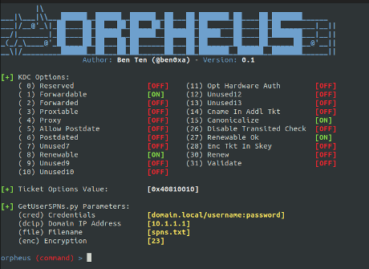

# Orpheus


Orpheus is a wrapper for a modified version of Impacket's GetUserSPNs.py and kerberosv5.py which alters the KDC Options (Ticket Options) and the Encryption Type for Kerberoasting. 

Side Note: Orpheus is named after the Greek god that was able to get past Cerberus (the three headed dog) to get into Hades.

# Installation / Running

You will need to install the latest version of [Impacket](https://github.com/SecureAuthCorp/impacket). This was tested on the [0.10.0 release](https://github.com/SecureAuthCorp/impacket/releases/tag/impacket_0_10_0). Then

```
git clone https://github.com/trustedsec/orpheus.git
cd orpheus
python3 orpheus.py
```

# Video
Check out the video on [YouTube](https://www.youtube.com/watch?v=SwbSq1dTz7Y)

# Blog Post
Check out the blog post on [TrustedSec](https://www.trustedsec.com/blog/the-art-of-bypassing-kerberoast-detections-with-orpheus/)
